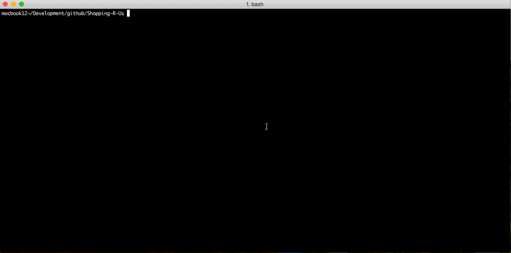

# Shopping-R-Us


## Successful Test Run




## Problem Statement


Shopping-R-Us is starting a computer store. You have been engaged to build the checkout system. We will start with the following products in our catalogue


| SKU     | Name              | Price       |
| --------:| ----------------:| ----------:|
| ipd       | Super iPad      | $549.99  |
| mbp     | MacBook Pro | $1399.99 |
| atv       | Apple TV         | $109.50   |
| vga      | VGA adapter   | $30.00     |

As we're launching our new computer store, we would like to have a few opening day specials.

*	We're going to have a 3 for 2 deal on Apple TVs. For example, if you buy 3 Apple TVs, you will pay the price of 2 only
*	The brand new Super iPad will have a bulk discounted applied, where the price will drop to $499.99 each, if someone buys more than 4
*	We will bundle in a free VGA adapter free of charge with every MacBook Pro sold

As our Sales manager is quite indecisive, we want the pricing rules to be as flexible as possible as they can change in the future with little notice.

Our checkout system can scan items in any order.

The interface to our checkout looks like this (shown in java):

```java
  Checkout co = new Checkout(pricingRules);
  co.scan(item1);
  co.scan(item2);
  co.total();
```

Your task is to implement a checkout system that fulfils the requirements described above.

Example scenarios
-----------------

SKUs Scanned: atv, atv, atv, vga
Total expected: $249.00

SKUs Scanned: atv, ipd, ipd, atv, ipd, ipd, ipd
Total expected: $2718.95

SKUs Scanned: mbp, vga, ipd
Total expected: $1949.98

Notes on implementation:

*	Use any language you wish
*	Don't build guis etc, we're more interested in your approach to solving the given task, not how shiny it looks
*	Don't worry about making a command line interface to the application
*	Don't use any frameworks (rails, spring etc), or any external jars/gems (unless it's for testing)


